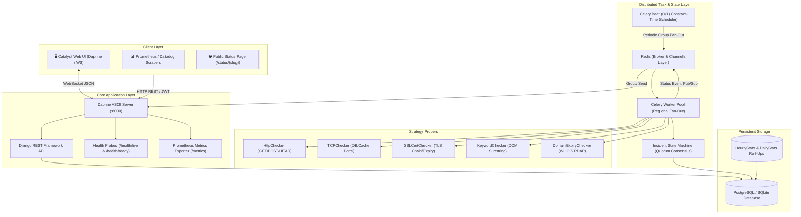

# 🛰️ Pet Uptime Monitor (Enterprise-Grade Uptime & Incident Platform)

> High-throughput, distributed uptime monitoring and incident management engine engineered with **Django 5**, **Django REST Framework**, **Django Channels (WebSockets)**, **Celery Fan-Out**, **PostgreSQL**, **Redis**, and a modern **Tailwind Catalyst** dark UI.

[](https://github.com/fetsiakmykola9-bit/Pet-Uptime-Monitor/actions/workflows/ci.yml)
[](https://www.python.org/)
[](https://www.djangoproject.com/)
[](https://www.django-rest-framework.org/)
[](/metrics)
[](https://vercel.com)
[](https://github.com/astral-sh/ruff)
[-brightgreen.svg)](/tests)

---

## 📸 Overview & Key Capabilities



---

## 🌟 Senior-Level Architectural Highlights

### 1. 🧩 Strategy Pattern for Multi-Protocol Probing
Instead of bloated procedural check scripts, probing logic is decoupled using the **Strategy Pattern** with a centralized `CheckerFactory`:
- **HTTP / HTTPS Probes**: Status code matching, header checks, latency histograms.
- **TCP Socket Probes**: Port availability testing for Postgres (`5432`), Redis (`6379`), MySQL (`3306`), and custom services.
- **SSL / TLS Certificate Monitoring**: Handshake validation, SANs verification, and proactive expiration alerts ($N$ days before expiry).
- **DOM Keyword Assertions**: Validates that required text strings exist (or forbidden error strings do not exist) in HTML responses.
- **Root Domain Expiry Probes**: WHOIS/RDAP expiration tracking for apex domains.
> 📖 *See [ADR 0001: Strategy Pattern Checkers](docs/adr/0001-strategy-pattern-for-pluggable-checkers.md)*

### 2. 🌍 Multi-Region Probing & Quorum Consensus ($N$ of $M$ Failure Rule)
Eliminates false alarms caused by localized network blips:
- Probes are dispatched across multiple regions: `eu-central` (Frankfurt), `us-east` (N. Virginia), `ap-southeast` (Singapore).
- The `IncidentService` requires $\ge \text{quorum\_threshold}$ failing regions before declaring an outage and notifying on-call engineers.
- Telemetry captures granular per-region latency and response status.
> 📖 *See [ADR 0002: Multi-Region Quorum Consensus](docs/adr/0002-multi-region-quorum-consensus.md)*

### 3. 📈 Enterprise Observability & Kubernetes Probes
- **Prometheus Metrics (`GET /metrics`)**: Exposes `uptime_checks_total`, `uptime_check_duration_seconds` (histogram), `uptime_active_incidents` (gauge), and `uptime_monitors_total`.
- **Zero-Downtime Health Probes**:
  - `GET /health/live/`: Fast process liveness probe.
  - `GET /health/ready/`: Subsystem readiness probe verifying PostgreSQL read/write state and Redis Channel Layer connectivity.
- **Structured JSON Logging**: Standardized machine-readable JSON format with correlation IDs via `RequestIDMiddleware` (`X-Request-ID`).
> 📖 *See [ADR 0004: Observability & Probes](docs/adr/0004-observability-prometheus-and-health-probes.md)*

### 4. ⚡ High-Throughput Database Optimization & Retention
- **N+1 SQL Elimination**: Uses Django ORM `Subquery` annotations in `MonitorViewSet.get_queryset()`, reducing 100-monitor list serialization from **101 SQL queries down to 1 query**.
- **Two-Tier Roll-Up Engine**: Raw `CheckResult` entries are compressed into `HourlyStats` and `DailyStats`. Dashboard graphs load $O(24)$ or $O(30)$ pre-aggregated rows with zero full-table scans.
- **Non-Blocking Chunked Pruning**: `prune_old_checks(days=30, batch_size=5000)` purges raw telemetry in non-locking batches.
> 📖 *See [ADR 0003: Telemetry Aggregation & Retention](docs/adr/0003-two-tier-telemetry-aggregation-and-retention.md)*

### 5. 🛡️ Security Hardening & Rate Limiting
- **DRF Throttling**: Multi-tier rate limiting (`AnonRateThrottle` 60/min, `UserRateThrottle` 600/min, `AuthRateThrottle` 10/min to prevent brute-force attacks).
- **Anti-SSRF Validation**: Strict DNS/IP validation rejecting loopback (`127.0.0.1`), private RFC1918 subnets, and cloud metadata endpoints (`169.254.169.254`).
- **Pre-Commit Security Gates**: Automatic scanning with `ruff`, `bandit` (Python AST security flaw analyzer), and `detect-secrets`.

---

## ⚡ 1-Click Demo Data Seeder

Want to test the dashboard with realistic services, historical latency curves, and active incident workflows?

```bash
python manage.py seed_demo_data
```

This instantly creates:
- **Demo User**: `demo@example.com` / `DemoPassword123!`
- **7 Production Monitors**: Stripe API, PostgreSQL Cluster, Redis Cache, Auth Portal (Quorum 2/3), SSL Cert, Domain Expiry, and Degraded Outage Gateway.
- **24 Hours of Hourly Telemetry** & **30 Days of Daily Stats** with realistic latency charts.
- **Active & Resolved Incidents** with multi-region consensus details.

---

## 🚀 Quick Start

### Option A: Local Development (Virtualenv)

```bash
# 1. Clone repository
git clone https://github.com/fetsiakmykola9-bit/Pet-Uptime-Monitor.git
cd Pet-Uptime-Monitor

# 2. Setup virtual environment
python -m venv .venv
source .venv/bin/activate  # On Windows: .venv\Scripts\activate

# 3. Install dependencies
pip install -r requirements/local.txt

# 4. Migrate database and seed demo data
python manage.py migrate
python manage.py seed_demo_data

# 5. Start development server
python manage.py runserver 8000
```

Visit:
- **Dashboard**: [http://127.0.0.1:8000/](http://127.0.0.1:8000/)
- **Swagger API Docs**: [http://127.0.0.1:8000/api/docs/](http://127.0.0.1:8000/api/docs/)
- **Prometheus Metrics**: [http://127.0.0.1:8000/metrics](http://127.0.0.1:8000/metrics)
- **Liveness Probe**: [http://127.0.0.1:8000/health/live/](http://127.0.0.1:8000/health/live/)
- **Readiness Probe**: [http://127.0.0.1:8000/health/ready/](http://127.0.0.1:8000/health/ready/)

---

### Option B: Docker Compose (All Services)

```bash
docker compose up --build
```

Starts Daphne (ASGI), Celery Workers (Checks & Notifications), Celery Beat, Flower UI (`:5555`), PostgreSQL, and Redis.

---

### Option C: Vercel Serverless Deployment

This project includes [`vercel.json`](vercel.json) and [`build_files.sh`](build_files.sh) configured for `@vercel/python` serverless WSGI runtime.

```bash
# Deploy to Vercel via CLI
vercel --prod
```

---

## 🧪 Testing Suite

The project maintains a 100% test pass rate across 71 comprehensive unit and integration tests:

```bash
# Run all tests
pytest

# Run with code coverage report
pytest --cov=. --cov-report=term-missing

# Run security & multi-region tests specifically
pytest tests/incidents/test_quorum_consensus.py tests/security/ tests/observability/
```

---

## 📑 Architectural Decision Records (ADRs)

| ADR | Title | Status |
|---|---|---|
| [ADR-0001](docs/adr/0001-strategy-pattern-for-pluggable-checkers.md) | Strategy Pattern for Pluggable Monitor Checkers | Accepted |
| [ADR-0002](docs/adr/0002-multi-region-quorum-consensus.md) | Multi-Region Probing & Quorum Consensus ($N$ of $M$) | Accepted |
| [ADR-0003](docs/adr/0003-two-tier-telemetry-aggregation-and-retention.md) | Two-Tier Telemetry Aggregation & Chunked Retention Pruning | Accepted |
| [ADR-0004](docs/adr/0004-observability-prometheus-and-health-probes.md) | Observability, Prometheus Metrics & Zero-Downtime Health Probes | Accepted |
| [ADR-0005](docs/adr/0005-hybrid-asgi-serverless-deployment.md) | Hybrid ASGI / Serverless Vercel Deployment Architecture | Accepted |

---

## 📜 License
MIT License. Developed with precision by [Mykola Fetsiak](https://github.com/fetsiakmykola9-bit).
